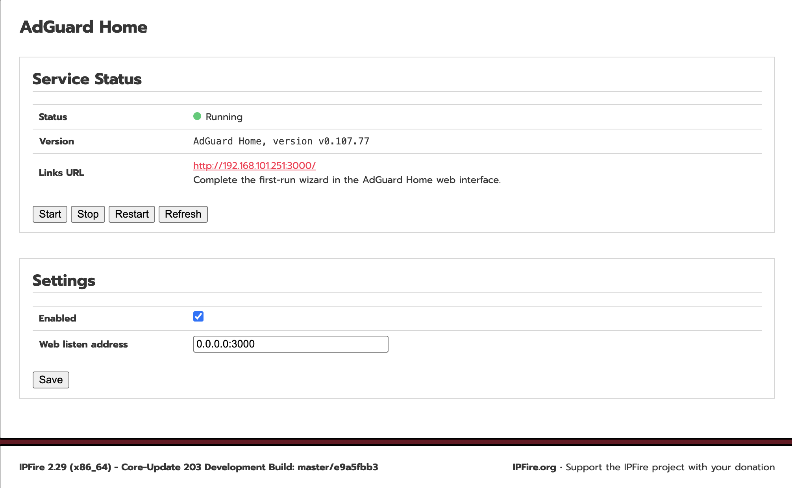

<div align="center">
  <a href="README.md">中文</a> |
  <a href="README.en.md">English</a>
</div>

# Tailscale for IPFire

# AdGuard Home for IPFire

<p>
  
  
  
</p>

AdGuard Home is a network-wide DNS filtering solution that provides ad blocking and privacy protection for all devices on your home or business network. All DNS requests from clients, including smartphones, computers, smart TVs and IoT devices, are routed through AdGuard Home, which can block advertisements, trackers and malicious domains while providing secure and controllable DNS resolution.

This project integrates AdGuard Home with the IPFire firewall and provides a native management experience on IPFire. It includes service management scripts, an IPFire Web UI menu entry, CGI management pages and a persistent configuration directory, allowing users to install, configure and maintain AdGuard Home as if it were a built-in IPFire component.

Tested on IPFire 2.29 (x86_64) - Core Update 203.

## screenshot



## Recommended DNS Flow

In IPFire Core 203 and later, the system DNS resolver is provided by Knot Resolver, which listens on port `53` by default. To make AdGuard Home effective for LAN clients, the recommended flow is:

```text
Client -> AdGuard Home:53 -> Knot Resolver:5353 -> Upstream DNS
```

This means:

- LAN clients continue to use IPFire port `53` as their DNS server.
- AdGuard Home listens on `0.0.0.0:53` and handles ad blocking, rule matching, query logs, and statistics.
- Knot Resolver is moved to `127.0.0.1:5353` and continues to act as IPFire's local recursive/forwarding resolver.
- AdGuard Home uses `127.0.0.1:5353` as its upstream DNS server.

## Install

```sh
sh install.sh
```

The installer uses the local binary at `src/opt/adguardhome/AdGuardHome` first. It downloads AdGuard Home for the detected architecture only when that file is missing.

After the first start, open:

```text
http://<ipfire-host>:3000/
```

If Knot Resolver is still using port `53`, set the AdGuard Home DNS listen port to `5353` or another free port during the first-run wizard. After the wizard is complete, switch to the production DNS flow with the steps below.

## Take Over Port 53

The following steps move Knot Resolver from port `53` to port `5353`, then let AdGuard Home take over port `53`.

Stop AdGuard Home first:

```sh
/etc/rc.d/init.d/adguardhome stop
```

Back up the configuration files:

```sh
cp -a /etc/knot-resolver/config.yaml /etc/knot-resolver/config.yaml.bak.$(date +%Y%m%d%H%M%S)
cp -a /var/ipfire/adguardhome/AdGuardHome.yaml /var/ipfire/adguardhome/AdGuardHome.yaml.bak.$(date +%Y%m%d%H%M%S)
```

Change the Knot Resolver listen address and port:

```sh
sed -i 's/interface: 0.0.0.0@53/interface: 127.0.0.1@5353/' /etc/knot-resolver/config.yaml
```

Change the AdGuard Home DNS listen port and upstream DNS:

```sh
perl -0pi -e 's/(dns:\n(?:.*\n)*?  port: )\d+/${1}53/s; s/(  upstream_dns:\n)(?:    - .*\n)+/${1}    - 127.0.0.1:5353\n/s' /var/ipfire/adguardhome/AdGuardHome.yaml
```

Restart the services:

```sh
/etc/rc.d/init.d/knot-resolver restart
/etc/rc.d/init.d/adguardhome start
```

## Verify

Check listening ports:

```sh
ss -lntup | grep -E ':(53|5353|3000)\b'
```

Expected result:

- `AdGuardHome` listens on `*:53`
- `kresd` listens on `127.0.0.1:5353`
- The AdGuard Home Web UI continues to listen on `*:3000`

Check service status:

```sh
/etc/rc.d/init.d/knot-resolver status
/etc/rc.d/init.d/adguardhome status
```

Test DNS queries:

```sh
dig @127.0.0.1 -p 53 example.com
dig @127.0.0.1 -p 5353 example.com
```

Port `53` should be answered by AdGuard Home, and port `5353` should be answered by Knot Resolver.

## Notes
The file `/etc/knot-resolver/config.yaml` contains `DO NOT EDIT as any changes will be overwritten` in its header. This means future IPFire updates may overwrite the Knot Resolver listen-port change. After upgrading IPFire, if AdGuard Home no longer takes over port `53`, check and restore this line:

```yaml
- interface: 127.0.0.1@5353
```

AdGuard Home's upstream DNS should remain:

```yaml
upstream_dns:
  - 127.0.0.1:5353
```

## Roll Back
To restore the default IPFire DNS behavior, stop AdGuard Home and move Knot Resolver back to port `53`:

```sh
/etc/rc.d/init.d/adguardhome stop
sed -i 's/interface: 127.0.0.1@5353/interface: 0.0.0.0@53/' /etc/knot-resolver/config.yaml
/etc/rc.d/init.d/knot-resolver restart
```

If you created a backup, you can restore it directly:

```sh
cp -a /etc/knot-resolver/config.yaml.bak.<timestamp> /etc/knot-resolver/config.yaml
/etc/rc.d/init.d/knot-resolver restart
```

## Uninstall

```sh
sh uninstall.sh
```

## Disclaimer
This is an unofficial community project with no affiliation to the IPFire team; use it at your own risk.