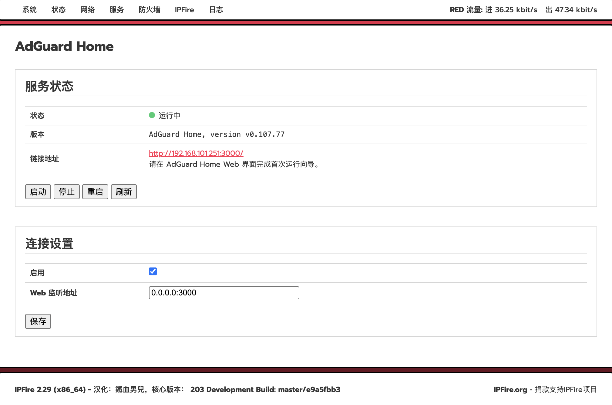

<div align="center">
  <a href="README.md">中文</a> |
  <a href="README.en.md">English</a>
</div>

# Tailscale for IPFire
        
# AdGuard Home for IPFire

<p>
  
  
  
</p>

AdGuard Home 是一个基于 DNS 的全网广告拦截和隐私保护解决方案，可为家庭和企业网络中的所有设备提供统一的 DNS 过滤服务。所有客户端（如手机、电脑、智能电视和 IoT 设备）的域名请求都会先经过 AdGuard Home，由其负责拦截广告、跟踪器、恶意域名，并提供安全、可控的 DNS 解析能力。

本项目是专为 IPFire 防火墙打造的集成项目，提供 AdGuard Home 的一键部署与管理能力。项目包含服务管理脚本、IPFire Web UI 菜单入口、CGI 管理页面以及持久化配置目录，实现与 IPFire 系统的深度集成，让用户能够像管理原生组件一样安装、配置和维护 AdGuard Home。

在 IPFire 2.29 (x86_64) -203 上测试通过。

## 设置界面



## 推荐DNS链路

在 IPFire Core 203 及之后版本中，系统 DNS 解析器由 Knot Resolver 提供，默认监听 `53` 端口。如果希望 AdGuard Home 对局域网客户端生效，推荐把链路调整为：

```text
客户端 -> AdGuard Home:53 -> Knot Resolver:5353 -> 上游 DNS
```

这样做的含义是：

- 局域网客户端继续使用 IPFire 的 `53` 端口作为 DNS。
- AdGuard Home 监听 `0.0.0.0:53`，负责广告过滤、规则匹配、查询日志和统计。
- Knot Resolver 改为只监听 `127.0.0.1:5353`，继续作为 IPFire 本机递归/转发解析器。
- AdGuard Home 的上游 DNS 设置为 `127.0.0.1:5353`。

## 安装插件

```sh
sh install.sh
```

安装脚本会优先使用 `src/opt/adguardhome/AdGuardHome` 中的本地二进制；如果该文件不存在，才会按当前系统架构远程下载 AdGuard Home。

首次启动后打开：

```text
http://<ipfire-host>:3000/
```

如果 Knot Resolver 仍在占用 `53` 端口，首次初始化 AdGuard Home 时可以先把 DNS 监听端口设置为 `5353` 或其他空闲端口，待初始化完成后再按下面步骤切换为正式链路。

## 接管53端口

以下步骤会把 Knot Resolver 从 `53` 端口移动到 `5353`，再让 AdGuard Home 接管 `53` 端口。

先停止 AdGuard Home：

```sh
/etc/rc.d/init.d/adguardhome stop
```

备份配置文件：

```sh
cp -a /etc/knot-resolver/config.yaml /etc/knot-resolver/config.yaml.bak.$(date +%Y%m%d%H%M%S)
cp -a /var/ipfire/adguardhome/AdGuardHome.yaml /var/ipfire/adguardhome/AdGuardHome.yaml.bak.$(date +%Y%m%d%H%M%S)
```

修改 Knot Resolver 监听端口：

```sh
sed -i 's/interface: 0.0.0.0@53/interface: 127.0.0.1@5353/' /etc/knot-resolver/config.yaml
```

修改 AdGuard Home DNS 监听端口和上游 DNS：

```sh
perl -0pi -e 's/(dns:\n(?:.*\n)*?  port: )\d+/${1}53/s; s/(  upstream_dns:\n)(?:    - .*\n)+/${1}    - 127.0.0.1:5353\n/s' /var/ipfire/adguardhome/AdGuardHome.yaml
```

重启服务：

```sh
/etc/rc.d/init.d/knot-resolver restart
/etc/rc.d/init.d/adguardhome start
```

## 验证

查看端口监听：

```sh
ss -lntup | grep -E ':(53|5353|3000)\b'
```

期望结果：

- `AdGuardHome` 监听 `*:53`
- `kresd` 监听 `127.0.0.1:5353`
- AdGuard Home Web UI 继续监听 `*:3000`

检查服务状态：

```sh
/etc/rc.d/init.d/knot-resolver status
/etc/rc.d/init.d/adguardhome status
```

测试 DNS 查询：

```sh
dig @127.0.0.1 -p 53 example.com
dig @127.0.0.1 -p 5353 example.com
```

其中 `53` 应由 AdGuard Home 响应，`5353` 应由 Knot Resolver 响应。

## 注意事项

`/etc/knot-resolver/config.yaml` 文件头包含 `DO NOT EDIT as any changes will be overwritten`。这表示 IPFire 后续更新可能会覆盖 Knot Resolver 的监听端口配置。升级 IPFire 后，如果 AdGuard Home 不再接管 `53` 端口，请重新检查并恢复这一行：

```yaml
- interface: 127.0.0.1@5353
```

AdGuard Home 的上游 DNS 应保持为：

```yaml
upstream_dns:
  - 127.0.0.1:5353
```

## 复原配置

如果需要恢复 IPFire 默认 DNS 行为，可以停止 AdGuard Home，并把 Knot Resolver 改回 `53` 端口：

```sh
/etc/rc.d/init.d/adguardhome stop
sed -i 's/interface: 127.0.0.1@5353/interface: 0.0.0.0@53/' /etc/knot-resolver/config.yaml
/etc/rc.d/init.d/knot-resolver restart
```

如果之前做过备份，也可以直接恢复备份文件：

```sh
cp -a /etc/knot-resolver/config.yaml.bak.<时间戳> /etc/knot-resolver/config.yaml
/etc/rc.d/init.d/knot-resolver restart
```

## 卸载插件

```sh
sh uninstall.sh
```
## 免责声明

这是一个非官方社区项目，与 IPFire 团队没有任何关联，自行承担使用过程中可能产生的风险。