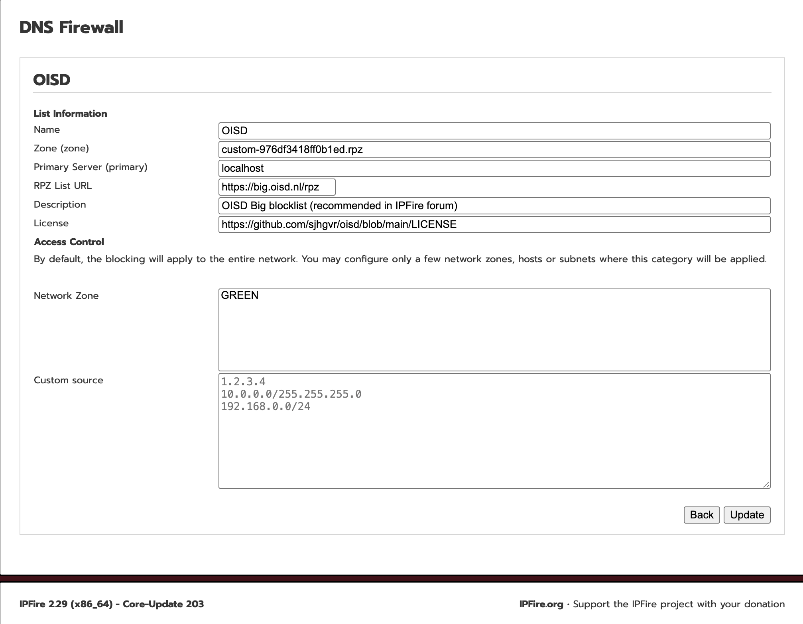

<div align="center">
  <a href="README.md">English</a> |
  <a href="README.CN.md">中文</a>
</div>

# IPFire DNS Firewall Custom Lists Extension

For **IPFire 2.29 Core Update 203**. This extension adds user-managed RPZ feeds to the existing DNS Firewall page while preserving the enable/disable and access-control behavior of the official lists.



## Features

- Adds an **Add** button immediately to the left of **Save**.
- Adds, edits, and deletes custom HTTPS RPZ feeds.
- Edits name, zone, primary, URL, description, license, and access control.
- Keeps official catalogue metadata read-only while allowing access-control changes.
- Stores custom entries in `/var/ipfire/dns/custom_dnsbl.json`, separate from the official catalogue.
- Uses HTTP `ETag` and `Last-Modified` validators; unchanged feeds return `304` without transferring the full file.
- Rejects HTML responses and RPZ data without an SOA record; validated data is replaced atomically.
- Updates official and custom feeds through `/usr/local/bin/update-rpzs`, under one lock and one DNS reload.
- Provides English and Simplified Chinese UI strings; other languages fall back to English.

## Install from the Community Repository

```sh
ipfrepo update
ipfrepo install dns-firewall-custom-lists
```

## Install from Source

Copy the source directory to IPFire, log in as root, and run:

```sh
cd dns-firewall-custom-lists
./install.sh
```

The installer validates Core Update 203 and required commands, checks script syntax, creates a timestamped backup under `/root`, installs the files and translations, rebuilds the language cache, prepares the shared lock, and reloads DNS. Existing custom-list configuration is preserved.

## Uninstallation

For a repository installation, run:

```sh
ipfrepo remove dns-firewall-custom-lists
```

For a source installation, run from the source directory:

```sh
./uninstall.sh
```

The uninstaller restores the official `dnsbl.cgi` and `update-rpzs` saved during the first installation, removes extension language entries, the lock, and legacy scheduling files. Custom configuration and RPZ files are backed up under `/root/dns-firewall-custom-lists-uninstall-<timestamp>/` before removal.

## Usage

Open `https://<ipfire-address>:444/cgi-bin/dnsbl.cgi`.

1. Click **Add** and enter a name and HTTPS RPZ URL.
2. A new list is enabled by default and downloaded in the background.
3. Use the pencil icon to edit metadata or access control.
4. Check or uncheck a list and click **Save** to apply its blocking state.
5. The delete icon appears only for custom lists and removes the entry, zone file, and HTTP cache validator.

OISD example from the IPFire community discussion:

- Name: `OISD`
- URL: `https://big.oisd.nl/rpz`
- Description: `OISD Big blocklist (recommended in IPFire forum)`
- License: `https://github.com/sjhgvr/oisd/blob/main/LICENSE`

## Unified update mechanism

Whenever the official `dnsctrl sync-rpzs` action runs, `/usr/local/bin/update-rpzs` synchronizes enabled official zones through AXFR/IXFR, conditionally checks enabled custom HTTPS RPZ files, and reloads DNS once. The entire operation holds `/var/ipfire/dns/rpz-update.lock`.

When the server's `ETag` or `Last-Modified` value is unchanged, it returns `304 Not Modified` and no list body is transferred. A full download, validation, and atomic replacement occurs only after the source changes. OISD does not offer AXFR/IXFR, so conditional HTTPS is the available incremental check for that feed.

Custom and official lists therefore have the same update triggers: IPFire's `%hourly,random` fcron runs once at a randomized time every hour; saving list state or manually invoking the official synchronization command also starts an update. Disabled custom lists are neither checked nor downloaded.

Logs:

```sh
grep update-rpzs /var/log/messages
```

Manual update check:

```sh
/usr/local/bin/dnsctrl sync-rpzs
```

## Installed files

- `/srv/web/ipfire/cgi-bin/dnsbl.cgi`
- `/usr/local/bin/update-rpzs`
- `/var/ipfire/dns/custom_dnsbl.json`
- `/var/ipfire/dns/rpz-update.lock`
- `/var/ipfire/dns/custom-lists-original/` (official restoration baseline)

## Validation

Validated on IPFire 2.29 x86_64 Core Update 203: installer and script syntax, English/Chinese UI, add/edit/delete, enable/disable, live DNS blocking, HTTP 304 conditional updates, failed-download preservation, atomic replacement, unified official/custom updates, and normal-domain DNS regression.

> Feed content, availability, and licensing remain the responsibility of each feed provider.
