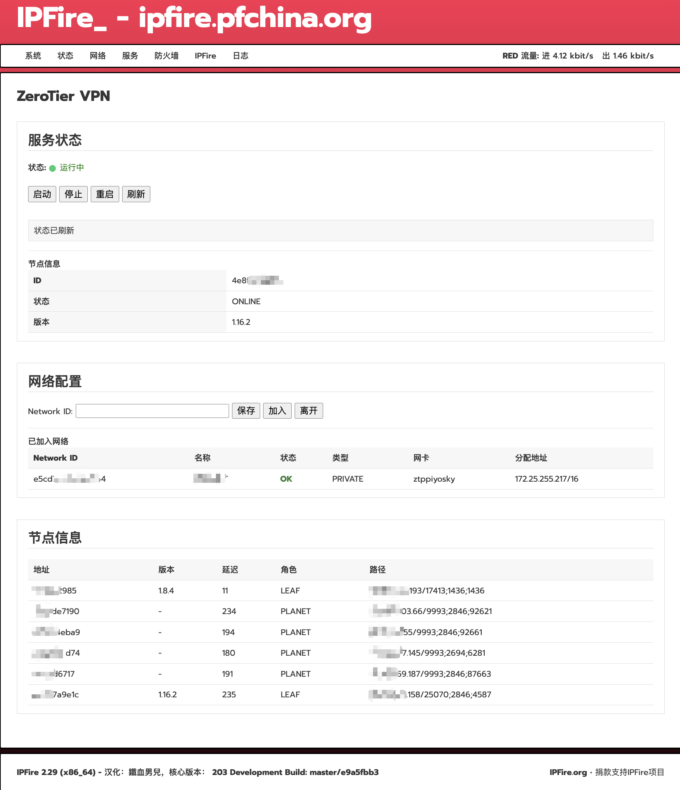

<div align="center">
  <a href="README.md">English</a> |
  <a href="README.CN.md">中文</a>
</div>


# IPFire 的 ZeroTier 插件


本项目为 IPFire WebUI 添加了一个 ZeroTier VPN 管理页面。CGI 页面直接内嵌了英文、简体中文和繁体中文语言包。
在 IPFire 2.29 (x86_64) -203 上测试通过。



## 安装

在 IPFire 系统中以 `root` 用户执行：

```sh
bash install.sh
```

安装完成后，打开 IPFire Web 管理界面，进入：

```text
服务（Services） > ZeroTier VPN
```

## 卸载

```sh
bash uninstall.sh
```

## 配置

默认配置文件安装在：

```text
/var/ipfire/zerotier/settings
```

其中：

```text
ALLOW_DEFAULT=on
```

表示允许使用 ZeroTier 管理的默认路由。

除非你明确希望通过 ZeroTier 网络提供默认路由（即让所有互联网流量经过 ZeroTier 网络），否则建议保持关闭状态。

## 配置

1. 点击 启动
2. 输入 Network ID
3. 点击 保存
4. 点击 加入
5. 登录 ZeroTier 控制台，对该节点进行授权（Authorize）

完成授权后，设备即可加入 ZeroTier 网络。

## 免责
这是一个非官方社区项目，与 IPFire 团队没有任何关联，自行承担使用过程中可能产生的风险。
