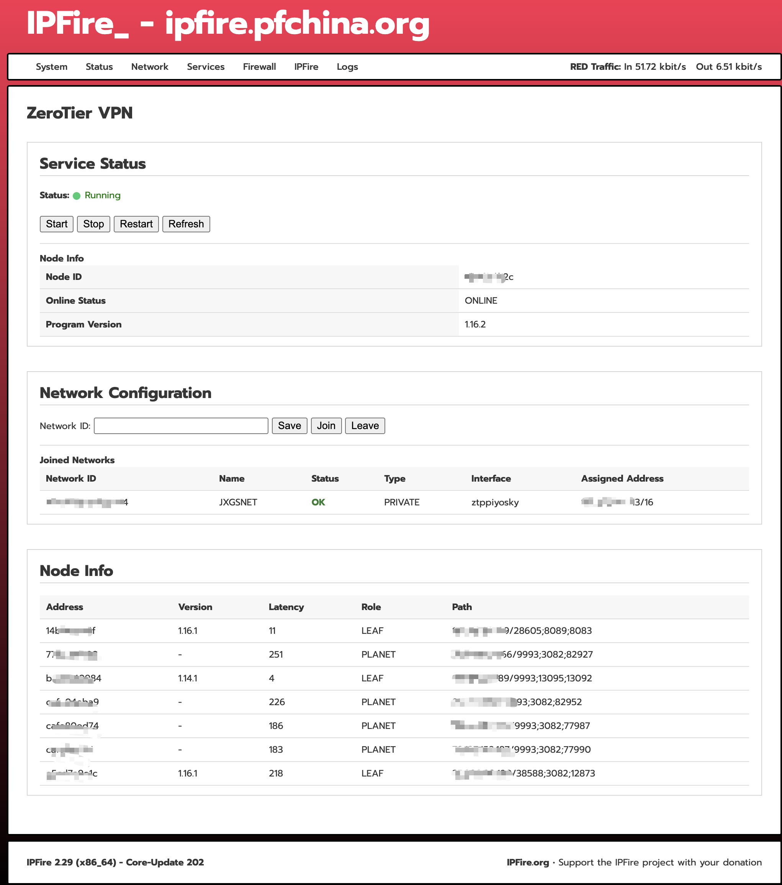

<div align="center">
  <a href="README.md">English</a> |
  <a href="README.CN.md">中文</a>
</div>

# ZeroTier for IPFire


This project adds a ZeroTier VPN management page to the IPFire WebUI. The CGI page directly embeds language packs for English, Simplified Chinese, and Traditional Chinese.
Tested and verified on IPFire 2.29 (x86_64) -202.



## Install

Run on IPFire as `root`:

```sh
bash install.sh
```

After installation, open the IPFire WebUI and go to:

```text
Services > ZeroTier VPN
```

## Uninstall

```sh
bash uninstall.sh
```

## Configuration

Default settings are installed to:

```text
/var/ipfire/zerotier/settings
```

`ALLOW_DEFAULT=on` allows ZeroTier-managed default routes. Keep it off unless
you intentionally want the ZeroTier network to provide default routing.

## Setup

Click "Start," enter the Network ID, save, and then click "Join." Then, go to the ZeroTier console to authorize the connection.

## Disclaimer
This is an unofficial community project with no affiliation to the IPFire team; use it at your own risk.